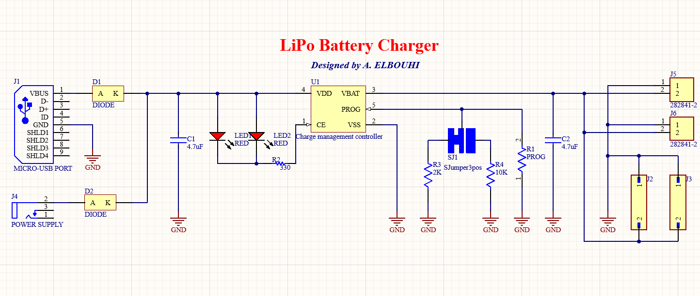
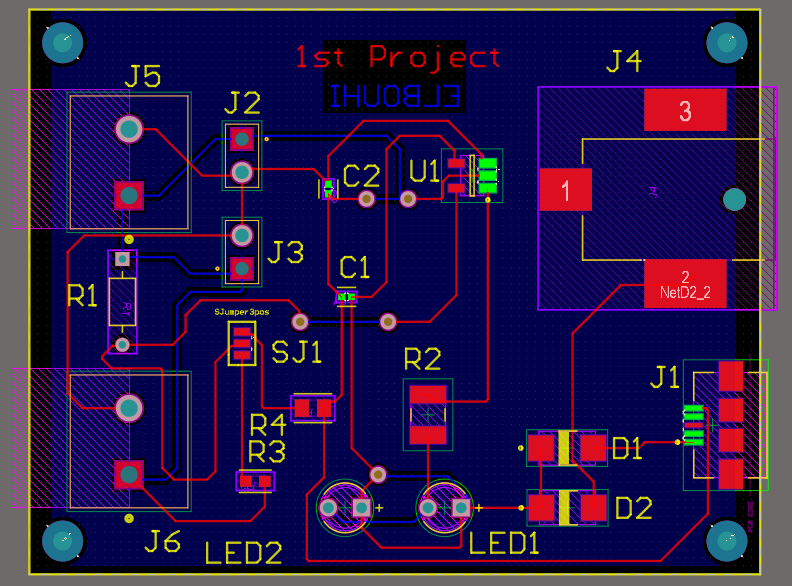
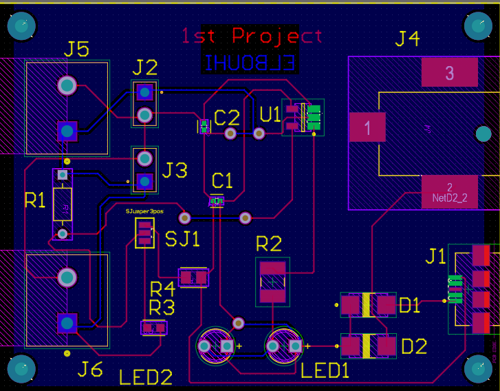
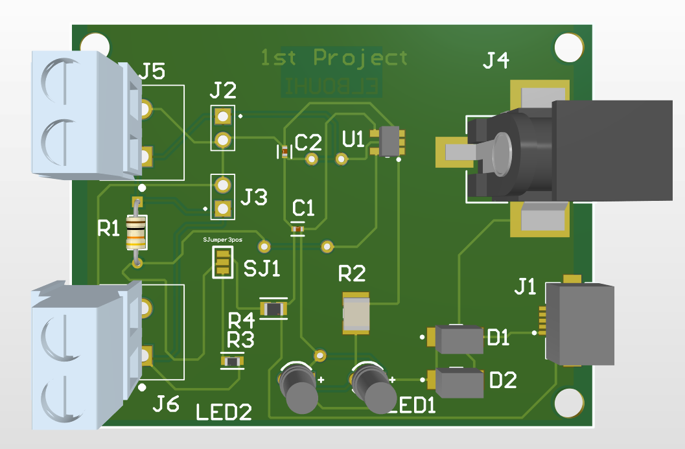
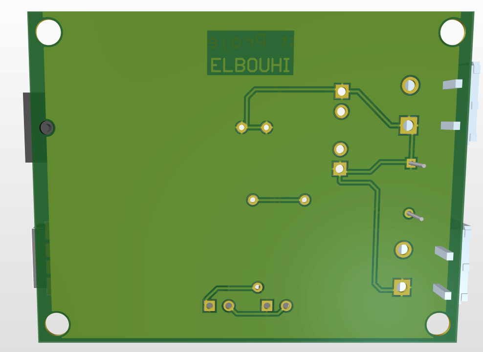
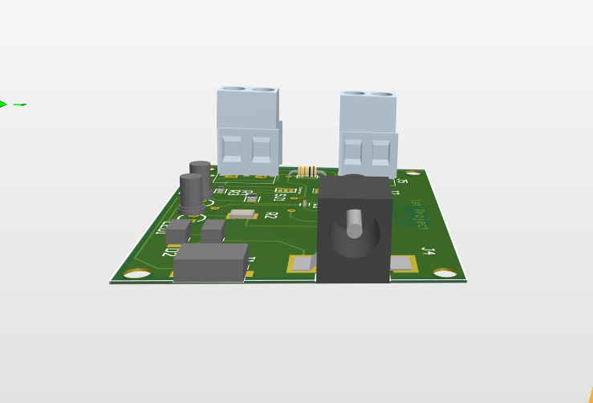

# LiPo Battery Charger PCB

## Overview
This repository contains a LiPo Battery Charger PCB designed using Altium Designer. The project was completed as part of my PCB design learning journey, covering the complete workflow from schematic design to PCB layout and manufacturing file generation.

## Project Objectives
- Design the schematic
- Create a 2-layer PCB layout
- Perform manual component placement
- Route all PCB traces manually
- Create a GND polygon
- Verify the design using Design Rule Check (DRC)
- Generate Gerber and NC Drill files for PCB manufacturing

## Software
- Altium Designer

## Repository Contents
- Altium project files (.PrjPcb, .SchDoc, .PcbDoc)
- Schematic PDF
- PCB images
- 3D PCB renders
- Gerber files
- NC Drill files

## Project Preview

### Schematic

### PCB Top

### PCB Bottom

### 3D Front

### 3D Back

### 3D Side

## Skills Demonstrated
- Schematic Capture
- PCB Layout
- Component Placement
- Manual Routing
- Ground Plane Design
- Design Rule Check (DRC)
- Gerber Generation
- NC Drill Generation
- PCB Documentation

## Project Status
Completed.

## License
This project is shared for educational and portfolio purposes.
